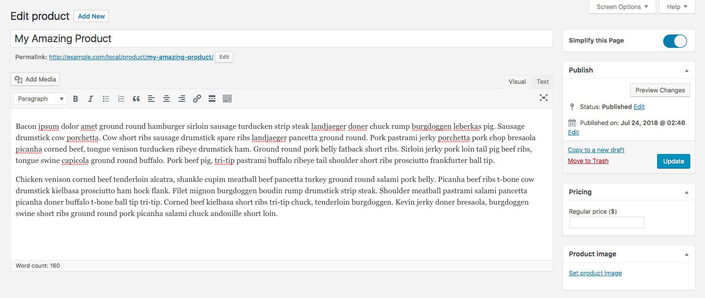

# WooSimple
[](https://travis-ci.org/liquidweb/woosimple)

A simplified WooCommerce product page, enabled by a simple setting on that page.

WooSimple provides a simplified WooCommerce product editing experience, letting you focus on only the most important fields.

Overwhelmed by all of the options on the product screen when you're just trying to add a simple product? Flip the "Simplify This Page" switch to hide it all, showing you only the most crucial fields.



## Installation

> **Note:** WooSimple is built using Sass and Grunt, and the repository as it exists may not be immediately ready to run after cloning. If you're not comfortable working with the command line, [each release on GitHub](https://github.com/liquidweb/woosimple/releases) should include a `woosimple.zip` attachment containing the compiled, production-ready plugin.

After cloning the repository, you'll need to build the plugin dependencies:

```sh
# Install dependencies via npm
$ npm install

# Build a release of the plugin
$ grunt build
```

The `dist/` directory will contain a copy of the plugin that's ready to install on a WordPress site, either via zip file or SFTP.
